# Gym Database System

Database project prepared for the **Database Basics** course in **Applied Computer Science, semester III**. The original project name used in the documentation is **`Siłownia`**.

This repository combines three deliverables in one place:

- a **SQLite database design** for a gym management system,
- a **Python desktop application** built with **Tkinter**,
- a **documentation set** with diagrams, screenshots, SQL examples, and report previews.

## Project overview

The project models the core operational processes of a fitness club located in Poland. It covers member records, employee and trainer management, membership sales, payments, class scheduling, registrations, equipment inventory, service requests, and report generation.

From a repository perspective, this project is not only a database assignment but also a compact software project consisting of:

- database scripts,
- a ready-to-use sample SQLite database,
- a desktop GUI for browsing and editing records,
- SQL showcase queries required for the course,
- JasperReports-related files,
- images used in the documentation.

>[!NOTE]
> The table names and seed data are written in Polish because the application was designed for use in Poland. This reflects the real operating context of the system and makes the database easier to understand in its intended domain.

## Main features

- complete gym database model in **SQLite**
- diagrams prepared in **Chen**, **Barker**, and **UML** notation
- relational model and entity descriptions
- validation logic implemented with **SQLite triggers**
- SQL queries covering the main business areas of the system
- desktop application for basic CRUD and data browsing
- SQL report previews and JasperReports integration
- repository structure separated into database, SQL, Python, and image assets

## Table of contents

- [Gym Database System](#gym-database-system)
  - [Project overview](#project-overview)
  - [Main features](#main-features)
  - [Table of contents](#table-of-contents)
  - [Technology stack](#technology-stack)
    - [Core technologies](#core-technologies)
    - [Modeling and documentation](#modeling-and-documentation)
  - [Repository structure](#repository-structure)
    - [File and directory descriptions](#file-and-directory-descriptions)
  - [How to run the project](#how-to-run-the-project)
    - [Requirements](#requirements)
    - [Run the desktop application](#run-the-desktop-application)
    - [Notes about reports](#notes-about-reports)
  - [Database files and data sources](#database-files-and-data-sources)
  - [Database design](#database-design)
    - [1. Chen notation](#1-chen-notation)
    - [2. Barker notation](#2-barker-notation)
    - [3. UML notation](#3-uml-notation)
    - [4. Relational model](#4-relational-model)
  - [Entity descriptions](#entity-descriptions)
    - [1. `Osoba` (Person)](#1-osoba-person)
    - [2. `Nr_telefonu` (Phone Number)](#2-nr_telefonu-phone-number)
    - [3. `Czlonek` (Member)](#3-czlonek-member)
    - [4. `Pracownik` (Employee)](#4-pracownik-employee)
    - [5. `Trener` (Trainer)](#5-trener-trainer)
    - [6. `Plan_karnetu` (Membership Plan)](#6-plan_karnetu-membership-plan)
    - [7. `Zakup_karnetu` (Membership Purchase)](#7-zakup_karnetu-membership-purchase)
    - [8. `Platnosc` (Payment)](#8-platnosc-payment)
    - [9. `Typ_zajec` (Class Type)](#9-typ_zajec-class-type)
    - [10. `Sesja_zajec` (Class Session)](#10-sesja_zajec-class-session)
    - [11. `Zapis` (Registration)](#11-zapis-registration)
    - [12. `Sprzet` (Equipment)](#12-sprzet-equipment)
    - [13. `Zgloszenia_serwisowe` (Service Requests)](#13-zgloszenia_serwisowe-service-requests)
  - [Stored procedures and triggers](#stored-procedures-and-triggers)
    - [Stored procedures](#stored-procedures)
    - [Trigger 1 – membership date validation](#trigger-1--membership-date-validation)
    - [Trigger 2 – class capacity validation](#trigger-2--class-capacity-validation)
  - [SQL queries](#sql-queries)
    - [Member management](#member-management)
      - [Query 1 – add a new member](#query-1--add-a-new-member)
      - [Query 2 – list members with phone numbers and active membership status](#query-2--list-members-with-phone-numbers-and-active-membership-status)
      - [Query 3 – search members with `LIKE` and status filtering](#query-3--search-members-with-like-and-status-filtering)
      - [Query 4 – members with no purchases in the last 90 days](#query-4--members-with-no-purchases-in-the-last-90-days)
      - [Query 5 – VIP ranking of the most active clients](#query-5--vip-ranking-of-the-most-active-clients)
    - [Membership sales and payments](#membership-sales-and-payments)
      - [Query 6 – membership sale with payment transaction](#query-6--membership-sale-with-payment-transaction)
      - [Query 7 – delete a membership purchase](#query-7--delete-a-membership-purchase)
      - [Query 8 – memberships expiring within 14 days](#query-8--memberships-expiring-within-14-days)
      - [Query 9 – monthly revenue report](#query-9--monthly-revenue-report)
      - [Query 10 – most popular membership plans](#query-10--most-popular-membership-plans)
      - [Query 11 – suspicious payments](#query-11--suspicious-payments)
      - [Query 12 – purchases more expensive than all base prices (`ALL` equivalent)](#query-12--purchases-more-expensive-than-all-base-prices-all-equivalent)
    - [Class schedule and session management](#class-schedule-and-session-management)
      - [Query 13 – class registration with validation](#query-13--class-registration-with-validation)
      - [Query 14 – list sessions with registered participants and free places](#query-14--list-sessions-with-registered-participants-and-free-places)
      - [Query 15 – almost full classes (≥ 80%)](#query-15--almost-full-classes--80)
      - [Query 16 – class type ranking for the last 30 days](#query-16--class-type-ranking-for-the-last-30-days)
      - [Query 17 – 5 nearest upcoming sessions (`ROW_NUMBER`)](#query-17--5-nearest-upcoming-sessions-row_number)
    - [Equipment and service management](#equipment-and-service-management)
      - [Query 18 – equipment with open service requests](#query-18--equipment-with-open-service-requests)
      - [Query 19 – service requests in progress](#query-19--service-requests-in-progress)
      - [Query 20 – service KPI by employee](#query-20--service-kpi-by-employee)
  - [Application and report previews](#application-and-report-previews)
    - [Members window](#members-window)
    - [Employees window](#employees-window)
    - [Class schedule window](#class-schedule-window)
    - [Equipment window](#equipment-window)
    - [Purchases and payments window](#purchases-and-payments-window)
    - [SQL reports](#sql-reports)
    - [Jasper reports](#jasper-reports)
  - [Future Improvments](#future-improvments)

## Technology stack

### Core technologies

- **SQLite** – relational database engine used by the project
- **SQL** – schema logic, business queries, filtering, reporting, and validation rules
- **Python 3** – application layer and desktop interface
- **Tkinter / ttk** – built-in GUI toolkit used for the desktop application
- **JasperReports / JasperStarter** – external report generation to PDF
- **Java** – required to run JasperStarter

### Modeling and documentation

- **Chen notation**
- **Barker notation**
- **UML notation**
- relational model documentation
- screenshots and visual documentation stored in `images/`

## Repository structure

```text
.
├── db/
│   ├── gym.db
│   ├── importing_data.sql
│   └── cleaning_data.sql
├── images/
│   └── diagrams, SQL report screenshots, and application screenshots
├── python/
│   ├── main.py
│   ├── database.py
│   ├── sql_queries.py
│   ├── tabs/
│   │   ├── base.py
│   │   ├── members.py
│   │   ├── employees.py
│   │   ├── equipment.py
│   │   ├── purchases.py
│   │   ├── schedule.py
│   │   └── reports.py
│   ├── reports_jrxml/
│   │   └── Cherry_Landscape.jrxml
│   └── tools/
│       └── jaspersoft/
│           ├── jasperstarter.jar
│           └── sqlite-jdbc-3.49.1.0.jar
└── sql/
    ├── All.sql
    └── Triggers.sql
```

### File and directory descriptions

- **[`db/gym.db`](/gym-database-system/db/gym.db)** – sample SQLite database file used by the desktop application.
- **[`db/importing_data.sql`](/gym-database-system/db/importing_data.sql)** – seed data for populating the database with example gym records.
- **[`db/cleaning_data.sql`](/gym-database-system/db/cleaning_data.sql)** – helper script for removing data from the database tables.
- **[`sql/All.sql`](/gym-database-system/sql/All.sql)** – collected SQL showcase queries and DML sequences prepared for the course requirements.
- **[`sql/Triggers.sql`](/gym-database-system/sql/Triggers.sql)** – SQLite trigger definitions used for data validation.
- **[`python/main.py`](/gym-database-system/python/main.py)** – application entry point that starts the Tkinter interface.
- **[`python/database.py`](/gym-database-system/python/database.py)** – database wrapper and transaction utilities for SQLite access.
- **[`python/sql_queries.py`](/gym-database-system/python/sql_queries.py)** – centralized catalog of SQL queries used by the application.
- **[`python/tabs/`](/gym-database-system/python/tabs/)** – GUI modules, each responsible for one functional area of the system.
- **[`python/reports_jrxml/`](/gym-database-system/python/reports_jrxml/)** – JasperReports templates and report-related resources.
- **[`python/tools/jaspersoft/`](/gym-database-system/python/tools/)** – local JasperStarter and SQLite JDBC files required for PDF report generation.
- **[`images/`](/gym-database-system/images/)** – diagrams, screenshots of the desktop application, and examples of generated reports.

## How to run the project

### Requirements

- Python 3.x
- SQLite database file included in the repository
- Tkinter available in the local Python installation
- Java runtime, if JasperReports export is to be used

### Run the desktop application

From the project root, run:

```bash
cd python
python main.py
```

The application opens a tabbed desktop interface for:

- members,
- employees,
- class schedule,
- equipment,
- purchases and payments,
- SQL reports and JasperReports.

### Notes about reports

The SQL reports work directly from the database through the Python application.

JasperReports export additionally depends on the files stored in:

- `python/tools/jaspersoft/jasperstarter.jar`
- `python/tools/jaspersoft/sqlite-jdbc-3.49.1.0.jar`

The generated output should be treated as local build/output data and should not be committed to GitHub.

## Database files and data sources

The repository contains both scripts and a ready SQLite file:

- **`db/gym.db`** – local working database used by the application,
- **`db/importing_data.sql`** – inserts sample data,
- **`db/cleaning_data.sql`** – clears the populated tables,
- **`sql/All.sql`** – contains representative SQL queries and transaction sequences,
- **`sql/Triggers.sql`** – contains the validation triggers.

This makes the repository useful both as:

- a **course project submission**,
- a **software repository**,
- a **documentation package**.

## Database design

### 1. Chen notation

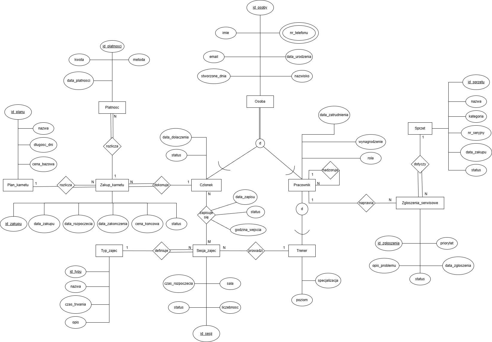

### 2. Barker notation

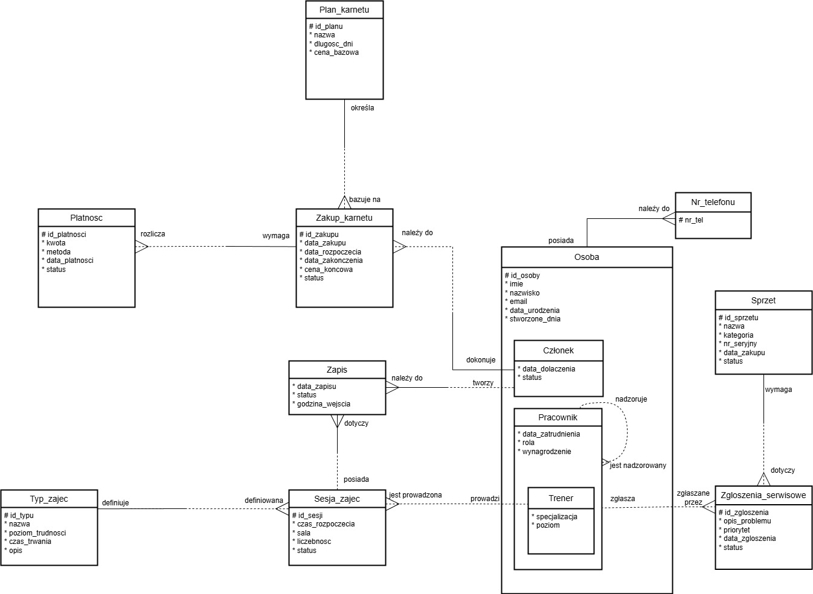

### 3. UML notation

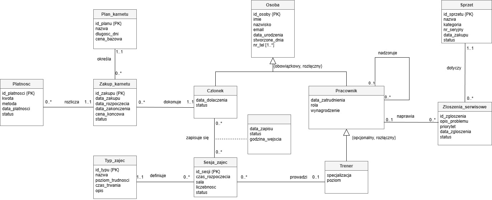

### 4. Relational model

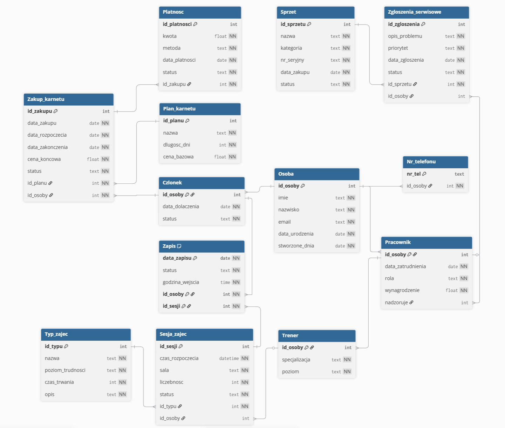

## Entity descriptions

### 1. `Osoba` (Person)

Base entity for people stored in the system. It is used as the parent entity for members and employees.

- `id_osoby` – primary key, unique person identifier
- `imie` – first name
- `nazwisko` – last name
- `email` – email address
- `data_urodzenia` – birth date in `YYYY-MM-DD` format
- `stworzone_dnia` – record creation date in `YYYY-MM-DD` format

### 2. `Nr_telefonu` (Phone Number)

Entity used to implement a multivalued phone number attribute.

- `nr_tel` – primary key, phone number
- `id_osoby` – foreign key to `Osoba`, assigning the number to a specific person

### 3. `Czlonek` (Member)

Specialization of `Osoba` used for gym members.

- `id_osoby` – primary key and foreign key to `Osoba`
- `data_dolaczenia` – date of joining the club
- `status` – membership status, for example `Aktywny` or `Zawieszony`

### 4. `Pracownik` (Employee)

Specialization of `Osoba` used for employees.

- `id_osoby` – primary key and foreign key to `Osoba`
- `data_zatrudnienia` – hire date
- `rola` – employee role, for example reception, manager, service, trainer
- `wynagrodzenie` – salary
- `nadzoruje` – foreign key pointing to the supervisor in `Pracownik`

### 5. `Trener` (Trainer)

Specialization of `Pracownik` for trainers.

- `id_osoby` – primary key and foreign key to `Pracownik`
- `specjalizacja` – training specialization
- `poziom` – trainer level or seniority

### 6. `Plan_karnetu` (Membership Plan)

Stores available membership plans.

- `id_planu` – primary key
- `nazwa` – plan name
- `dlugosc_dni` – duration in days
- `cena_bazowa` – base price

### 7. `Zakup_karnetu` (Membership Purchase)

Represents a purchased membership plan.

- `id_zakupu` – primary key
- `data_zakupu` – purchase date
- `data_rozpoczecia` – membership start date
- `data_zakonczenia` – membership end date
- `cena_koncowa` – final price
- `status` – purchase status, for example `Aktywny` or `Anulowany`
- `id_planu` – foreign key to `Plan_karnetu`
- `id_osoby` – foreign key to `Czlonek`

### 8. `Platnosc` (Payment)

Stores payments related to membership purchases.

- `id_platnosci` – primary key
- `kwota` – payment amount
- `metoda` – payment method, for example cash, card, transfer, or BLIK
- `data_platnosci` – payment date
- `status` – payment status, for example `Oczekujaca` or `Oplacona`
- `id_zakupu` – foreign key to `Zakup_karnetu`

### 9. `Typ_zajec` (Class Type)

Stores the class catalog.

- `id_typu` – primary key
- `nazwa` – class name
- `poziom_trudnosci` – difficulty level
- `czas_trwania` – class duration, for example in minutes
- `opis` – class description

### 10. `Sesja_zajec` (Class Session)

Represents a specific scheduled class session.

- `id_sesji` – primary key
- `czas_rozpoczecia` – start date and time
- `sala` – room name
- `liczebnosc` – capacity limit
- `status` – session status, for example planned, cancelled, or finished
- `id_typu` – foreign key to `Typ_zajec`
- `id_osoby` – foreign key to `Trener`, identifying the assigned trainer

### 11. `Zapis` (Registration)

Associative entity for member-to-session registrations.

- `id_osoby` – foreign key to `Czlonek`
- `id_sesji` – foreign key to `Sesja_zajec`
- `data_zapisu` – registration date
- `status` – registration or attendance status
- `godzina_wejscia` – check-in time

This table represents the many-to-many relationship between members and class sessions and contains additional attributes related to the registration itself.

### 12. `Sprzet` (Equipment)

Stores the gym equipment inventory.

- `id_sprzetu` – primary key
- `nazwa` – equipment name
- `kategoria` – category, for example cardio, strength, free weights
- `nr_seryjny` – serial number
- `data_zakupu` – purchase date
- `status` – technical status, for example operational, under repair, or retired

### 13. `Zgloszenia_serwisowe` (Service Requests)

Stores equipment maintenance and service tickets.

- `id_zgloszenia` – primary key
- `opis_problemu` – issue description
- `priorytet` – priority, for example low, medium, high
- `data_zgloszenia` – reporting date
- `status` – ticket status, for example open, in progress, finished
- `id_sprzetu` – foreign key to `Sprzet`
- `id_osoby` – foreign key to `Pracownik`, identifying the assigned employee

## Stored procedures and triggers

### Stored procedures

SQLite does not provide a native stored procedure mechanism in the same way as systems such as PostgreSQL, Oracle, or MySQL.  
Because of that, the project uses **triggers** and application-side logic instead of server-side procedural code.

### Trigger 1 – membership date validation

Validates `data_rozpoczecia` and `data_zakonczenia` when inserting a record into `Zakup_karnetu`.

```sql
CREATE TRIGGER IF NOT EXISTS trg_zakup_dates_validate_ins
BEFORE INSERT ON Zakup_karnetu
FOR EACH ROW
WHEN NEW.data_rozpoczecia IS NOT NULL
 AND NEW.data_zakonczenia IS NOT NULL
 AND date(NEW.data_zakonczenia) < date(NEW.data_rozpoczecia)
BEGIN
  SELECT RAISE(ABORT, 'Zakup_karnetu: data_zakonczenia nie może być wcześniejsza niż data_rozpoczecia');
END;
```

### Trigger 2 – class capacity validation

Blocks new registrations when the class capacity has already been reached.

```sql
CREATE TRIGGER IF NOT EXISTS trg_zapis_limit_miejsc
BEFORE INSERT ON Zapis
FOR EACH ROW
WHEN (
  (SELECT COUNT(*)
   FROM Zapis z
   WHERE z.id_sesji = NEW.id_sesji
     AND z.status IN ('Potwierdzony')
  ) >=
  (SELECT s.liczebnosc
   FROM Sesja_zajec s
   WHERE s.id_sesji = NEW.id_sesji
  )
)
BEGIN
  SELECT RAISE(ABORT, 'Brak wolnych miejsc na tę sesję zajęć');
END;
```

## SQL queries

### Member management

Functional goal: managing customer data, monitoring activity, and searching the member base.

#### Query 1 – add a new member

Transaction inserting data into `Osoba`, `Nr_telefonu`, and `Czlonek`.

```sql
BEGIN;

INSERT INTO Osoba(imie, nazwisko, email, data_urodzenia, stworzone_dnia)
VALUES(?, ?, ?, ?, date('now'));

INSERT INTO Nr_telefonu(nr_tel, id_osoby)
VALUES(?, last_insert_rowid());

INSERT INTO Czlonek(id_osoby, data_dolaczenia, status)
VALUES(last_insert_rowid(), date('now'), 'Aktywny');

COMMIT;
```

#### Query 2 – list members with phone numbers and active membership status

```sql
SELECT
  c.id_osoby, o.imie, o.nazwisko, o.email,
  COALESCE(GROUP_CONCAT(t.nr_tel, ', '), '') AS telefony,
  c.data_dolaczenia, c.status AS status_czlonka,
  (
    SELECT zk.status
    FROM Zakup_karnetu zk
    WHERE zk.id_osoby = c.id_osoby
      AND date('now') BETWEEN zk.data_rozpoczecia AND zk.data_zakonczenia
    ORDER BY zk.data_zakupu DESC
    LIMIT 1
  ) AS status_aktywny_karnet
FROM Czlonek c
JOIN Osoba o ON o.id_osoby = c.id_osoby
LEFT JOIN Nr_telefonu t ON t.id_osoby = o.id_osoby
GROUP BY c.id_osoby
ORDER BY o.nazwisko, o.imie;
```

#### Query 3 – search members with `LIKE` and status filtering

```sql
SELECT
  c.id_osoby, o.imie, o.nazwisko, o.email,
  COALESCE(GROUP_CONCAT(t.nr_tel, ', '), '') AS telefony,
  c.data_dolaczenia, c.status
FROM Czlonek c
JOIN Osoba o ON o.id_osoby = c.id_osoby
LEFT JOIN Nr_telefonu t ON t.id_osoby = o.id_osoby
WHERE (o.nazwisko LIKE ? OR o.email LIKE ?)
  AND (? = '' OR c.status = ?)
GROUP BY c.id_osoby
ORDER BY o.nazwisko;
```

#### Query 4 – members with no purchases in the last 90 days

```sql
SELECT c.id_osoby, o.imie, o.nazwisko, c.status
FROM Czlonek c
JOIN Osoba o ON o.id_osoby = c.id_osoby
WHERE NOT EXISTS (
  SELECT 1
  FROM Zakup_karnetu zk
  WHERE zk.id_osoby = c.id_osoby
    AND date(zk.data_zakupu) >= date('now', '-90 day')
)
ORDER BY o.nazwisko, o.imie;
```

#### Query 5 – VIP ranking of the most active clients

```sql
SELECT
  o.id_osoby,
  o.nazwisko || ' ' || o.imie AS czlonek,
  COUNT(*) AS liczba_zakupow,
  ROUND(SUM(zk.cena_koncowa), 2) AS suma
FROM Zakup_karnetu zk
JOIN Osoba o ON o.id_osoby = zk.id_osoby
WHERE strftime('%Y', zk.data_zakupu) = ?
  AND zk.status IN ('Aktywny','Zakończony')
GROUP BY o.id_osoby
HAVING COUNT(*) >= ?
ORDER BY suma DESC, liczba_zakupow DESC;
```

### Membership sales and payments

Functional goal: handling membership plan sales and revenue control.

#### Query 6 – membership sale with payment transaction

```sql
BEGIN;

INSERT INTO Zakup_karnetu(
  data_zakupu, data_rozpoczecia, data_zakonczenia, cena_koncowa, status, id_planu, id_osoby
)
SELECT
  date('now'),
  date('now'),
  date('now', '+' || pk.dlugosc_dni || ' day'),
  pk.cena_bazowa,
  'Aktywny',
  pk.id_planu,
  ?
FROM Plan_karnetu pk
WHERE pk.id_planu = ?;

INSERT INTO Platnosc(kwota, metoda, data_platnosci, status, id_zakupu)
VALUES(?, ?, date('now'), ?, last_insert_rowid());

COMMIT;
```

#### Query 7 – delete a membership purchase

```sql
BEGIN;

DELETE FROM Zakup_karnetu WHERE id_zakupu = ?;

COMMIT;
```

#### Query 8 – memberships expiring within 14 days

```sql
SELECT
  o.nazwisko, o.imie,
  zk.data_zakonczenia,
  pk.nazwa AS plan,
  zk.status
FROM Zakup_karnetu zk
JOIN Czlonek c ON c.id_osoby = zk.id_osoby
JOIN Osoba o ON o.id_osoby = c.id_osoby
JOIN Plan_karnetu pk ON pk.id_planu = zk.id_planu
WHERE zk.status IN ('Aktywny')
  AND date(zk.data_zakonczenia) BETWEEN date('now') AND date('now', '+14 day')
ORDER BY zk.data_zakonczenia ASC, o.nazwisko ASC;
```

#### Query 9 – monthly revenue report

```sql
SELECT
  strftime('%Y-%m', p.data_platnosci) AS miesiac,
  p.metoda,
  COUNT(*) AS liczba_platnosci,
  SUM(p.kwota) AS suma
FROM Platnosc p
WHERE strftime('%Y', p.data_platnosci) = ?
  AND p.status = 'Opłacona'
GROUP BY miesiac, p.metoda
HAVING SUM(p.kwota) > ?
ORDER BY miesiac, p.metoda;
```

#### Query 10 – most popular membership plans

```sql
SELECT
  pk.nazwa,
  COUNT(*) AS liczba_zakupow,
  ROUND(AVG(zk.cena_koncowa), 2) AS srednia_cena
FROM Zakup_karnetu zk
JOIN Plan_karnetu pk ON pk.id_planu = zk.id_planu
WHERE strftime('%Y', zk.data_zakupu) = ?
GROUP BY pk.id_planu
HAVING COUNT(*) >= ?
ORDER BY liczba_zakupow DESC, pk.nazwa ASC;
```

#### Query 11 – suspicious payments

```sql
SELECT
  p.id_platnosci,
  p.data_platnosci,
  p.kwota,
  pk.nazwa AS plan,
  pk.cena_bazowa,
  o.nazwisko || ' ' || o.imie AS czlonek
FROM Platnosc p
JOIN Zakup_karnetu zk ON zk.id_zakupu = p.id_zakupu
JOIN Plan_karnetu pk ON pk.id_planu = zk.id_planu
JOIN Osoba o ON o.id_osoby = zk.id_osoby
WHERE p.status = 'Opłacona'
  AND p.kwota < pk.cena_bazowa
ORDER BY p.data_platnosci DESC;
```

#### Query 12 – purchases more expensive than all base prices (`ALL` equivalent)

```sql
SELECT
  zk.id_zakupu, zk.cena_koncowa, pk.nazwa, o.nazwisko || ' ' || o.imie AS czlonek
FROM Zakup_karnetu zk
JOIN Plan_karnetu pk ON pk.id_planu = zk.id_planu
JOIN Osoba o ON o.id_osoby = zk.id_osoby
WHERE zk.cena_koncowa > (SELECT MAX(cena_bazowa) FROM Plan_karnetu)
ORDER BY zk.cena_koncowa DESC;
```

### Class schedule and session management

Functional goal: handling the class schedule and member registrations.

#### Query 13 – class registration with validation

```sql
INSERT INTO Zapis(data_zapisu, status, godzina_wejscia, id_osoby, id_sesji)
SELECT date('now'), 'Potwierdzony', strftime('%H:%M', 'now'), ?, ?
WHERE
  EXISTS (SELECT 1 FROM Czlonek c WHERE c.id_osoby = ? AND c.status = 'Aktywny')
  AND EXISTS (
    SELECT 1 FROM Zakup_karnetu zk
    WHERE zk.id_osoby = ?
      AND zk.status IN ('Aktywny')
      AND date('now') BETWEEN zk.data_rozpoczecia AND zk.data_zakonczenia
  )
  AND EXISTS (
    SELECT 1 FROM Sesja_zajec sz
    WHERE sz.id_sesji = ?
      AND sz.status IN ('Zaplanowana', 'Otwarta')
  )
  AND NOT EXISTS (
    SELECT 1 FROM Zapis z
    WHERE z.id_osoby = ? AND z.id_sesji = ? AND z.data_zapisu = date('now')
  )
  AND (
    SELECT COUNT(*)
    FROM Zapis z2
    WHERE z2.id_sesji = ?
      AND z2.status IN ('Potwierdzony')
  ) < (SELECT sz2.liczebnosc FROM Sesja_zajec sz2 WHERE sz2.id_sesji = ?);
```

#### Query 14 – list sessions with registered participants and free places

```sql
SELECT
  sz.id_sesji,
  tz.nazwa AS typ_zajec,
  COALESCE(o.nazwisko || ' ' || o.imie, 'Brak') AS trener,
  sz.czas_rozpoczecia,
  sz.sala,
  sz.liczebnosc AS limit_miejsc,
  COUNT(z.id_osoby) AS zapisanych,
  (sz.liczebnosc - COUNT(z.id_osoby)) AS wolnych
FROM Sesja_zajec sz
JOIN Typ_zajec tz ON tz.id_typu = sz.id_typu
LEFT JOIN Trener t ON t.id_osoby = sz.id_osoby
LEFT JOIN Osoba o ON o.id_osoby = t.id_osoby
LEFT JOIN Zapis z
  ON z.id_sesji = sz.id_sesji
 AND z.status IN ('Potwierdzony')
GROUP BY sz.id_sesji
ORDER BY sz.czas_rozpoczecia DESC;
```

#### Query 15 – almost full classes (≥ 80%)

```sql
SELECT
  sz.id_sesji,
  tz.nazwa AS typ_zajec,
  COALESCE(o.nazwisko || ' ' || o.imie, 'Brak') AS trener,
  sz.czas_rozpoczecia,
  sz.sala,
  sz.liczebnosc AS limit_miejsc,
  COUNT(z.id_osoby) AS zapisanych,
  (sz.liczebnosc - COUNT(z.id_osoby)) AS wolnych
FROM Sesja_zajec sz
JOIN Typ_zajec tz ON tz.id_typu = sz.id_typu
LEFT JOIN Trener t ON t.id_osoby = sz.id_osoby
LEFT JOIN Osoba o ON o.id_osoby = t.id_osoby
LEFT JOIN Zapis z
  ON z.id_sesji = sz.id_sesji
 AND z.status IN ('Potwierdzony')
GROUP BY sz.id_sesji
HAVING COUNT(z.id_osoby) >= sz.liczebnosc * 0.8
ORDER BY sz.czas_rozpoczecia DESC;
```

#### Query 16 – class type ranking for the last 30 days

```sql
WITH zapisy30 AS (
  SELECT z.id_sesji
  FROM Zapis z
  WHERE date(z.data_zapisu) >= date('now', '-30 day')
    AND z.status IN ('Potwierdzony')
)
SELECT
  tz.nazwa,
  COUNT(*) AS liczba_zapisow
FROM zapisy30 x
JOIN Sesja_zajec sz ON sz.id_sesji = x.id_sesji
JOIN Typ_zajec tz ON tz.id_typu = sz.id_typu
GROUP BY tz.id_typu
ORDER BY liczba_zapisow DESC, tz.nazwa ASC;
```

#### Query 17 – 5 nearest upcoming sessions (`ROW_NUMBER`)

```sql
SELECT *
FROM (
  SELECT
    sz.id_sesji,
    tz.nazwa AS typ,
    sz.czas_rozpoczecia,
    sz.sala,
    ROW_NUMBER() OVER (ORDER BY sz.czas_rozpoczecia ASC) AS rn
  FROM Sesja_zajec sz
  JOIN Typ_zajec tz ON tz.id_typu = sz.id_typu
  WHERE datetime(sz.czas_rozpoczecia) >= datetime('now')
    AND sz.status IN ('Zaplanowana', 'Otwarta')
)
WHERE rn <= 5
ORDER BY czas_rozpoczecia ASC;
```

### Equipment and service management

Functional goal: monitoring equipment status and handling service requests.

#### Query 18 – equipment with open service requests

```sql
SELECT
  s.id_sprzetu,
  s.nazwa,
  s.kategoria,
  s.status AS status_sprzetu,
  COUNT(zs.id_zgloszenia) AS otwartych_zgloszen
FROM Sprzet s
LEFT JOIN Zgloszenia_serwisowe zs
  ON zs.id_sprzetu = s.id_sprzetu
 AND zs.status IN ('W toku', 'W naprawie', 'Zgłoszone')
GROUP BY s.id_sprzetu
HAVING otwartych_zgloszen > 0
ORDER BY otwartych_zgloszen DESC, s.kategoria, s.nazwa;
```

#### Query 19 – service requests in progress

```sql
SELECT
  zs.id_zgloszenia,
  zs.data_zgloszenia,
  zs.priorytet,
  zs.status,
  s.nazwa AS sprzet,
  s.nr_seryjny
FROM Zgloszenia_serwisowe zs
JOIN Sprzet s ON s.id_sprzetu = zs.id_sprzetu
WHERE zs.status IN ('Zgłoszony', 'W toku', 'W naprawie')
ORDER BY
  CASE zs.priorytet
    WHEN 'Wysoki' THEN 1
    WHEN 'Średni' THEN 2
    ELSE 3
  END,
  zs.data_zgloszenia DESC;
```

#### Query 20 – service KPI by employee

```sql
SELECT
  p.id_osoby,
  o.nazwisko || ' ' || o.imie AS pracownik,
  COUNT(*) AS liczba_zgloszen
FROM Zgloszenia_serwisowe zs
JOIN Pracownik p ON p.id_osoby = zs.id_osoby
JOIN Osoba o ON o.id_osoby = p.id_osoby
WHERE strftime('%Y-%m', zs.data_zgloszenia) = ?
GROUP BY p.id_osoby
HAVING COUNT(*) >= ?
ORDER BY liczba_zgloszen DESC;
```

## Application and report previews

### Members window

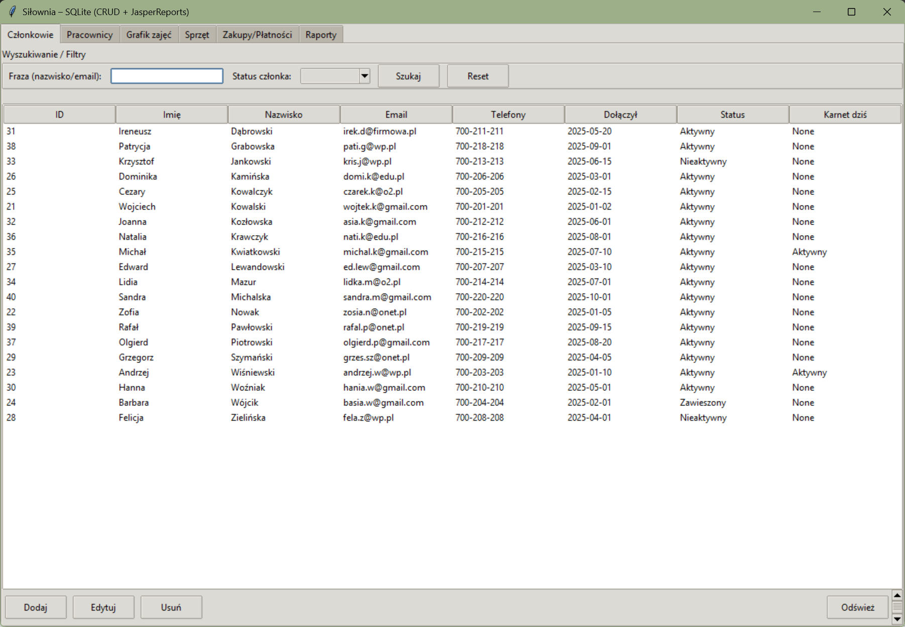

### Employees window

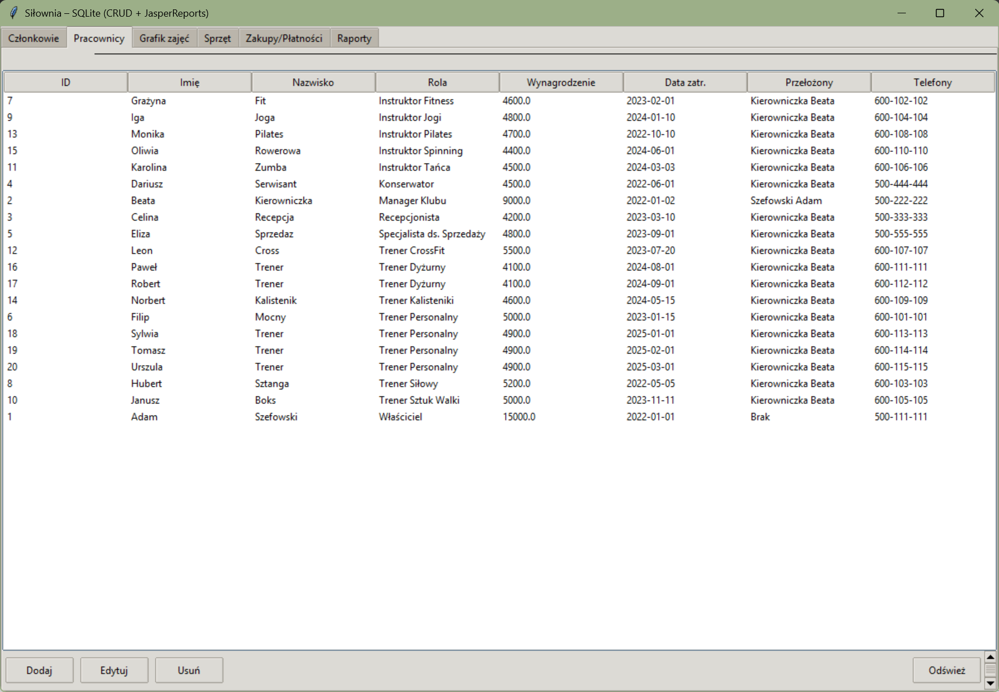

### Class schedule window

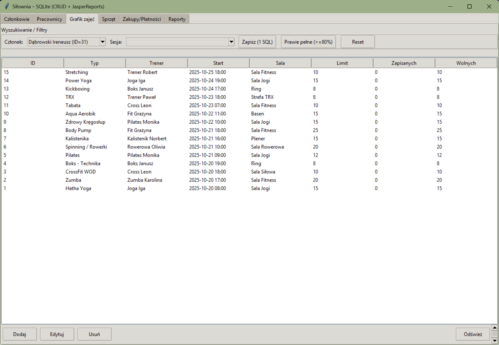

### Equipment window

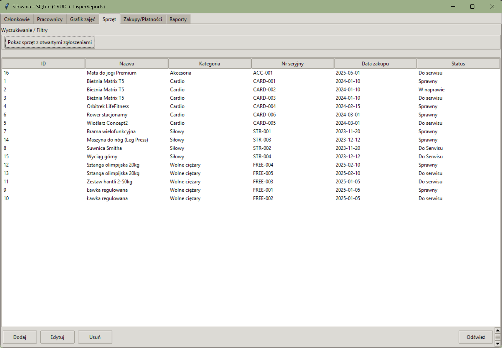

### Purchases and payments window

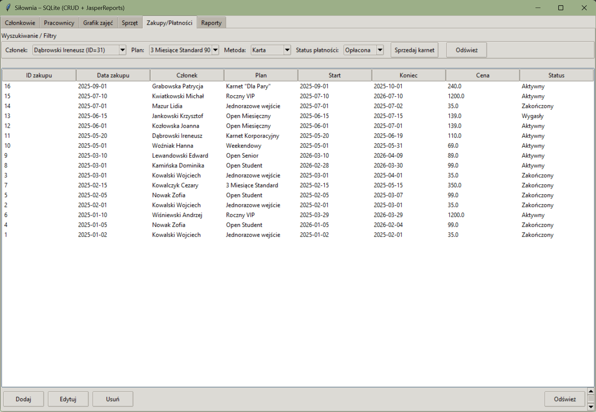

### SQL reports

Examples of report output generated from SQL queries:

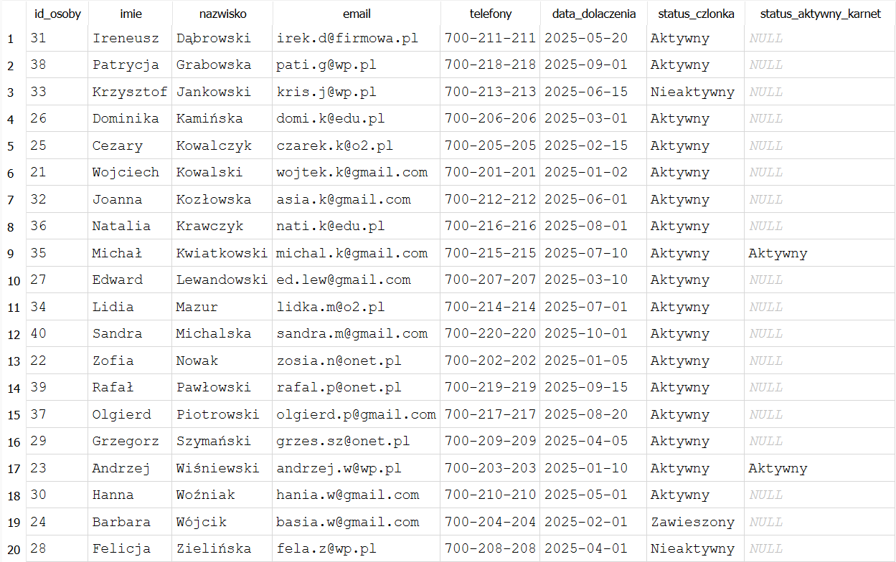
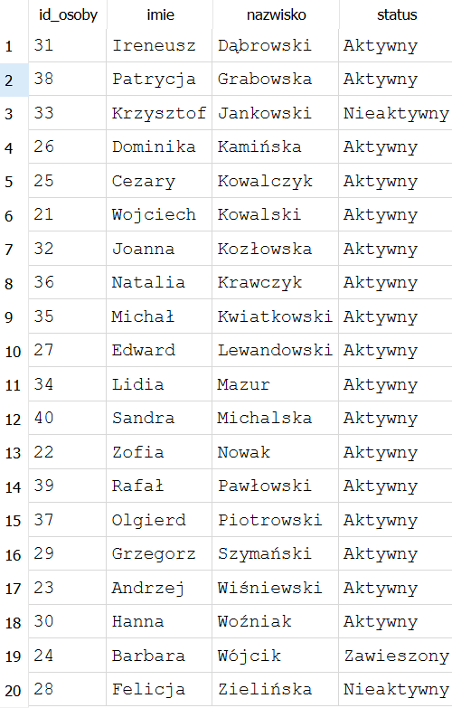
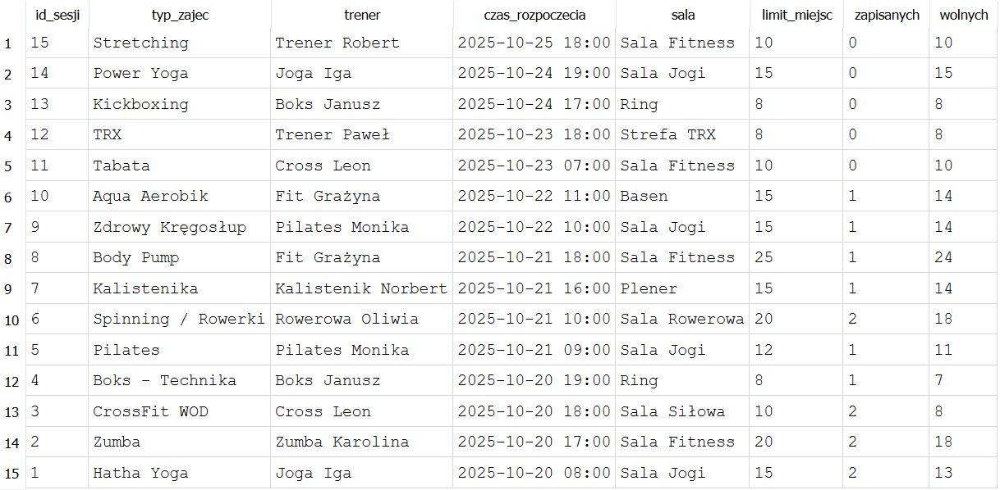
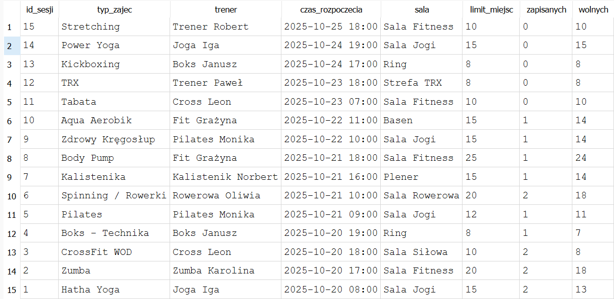
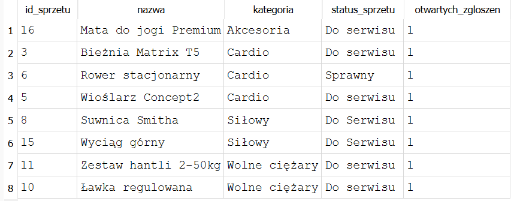
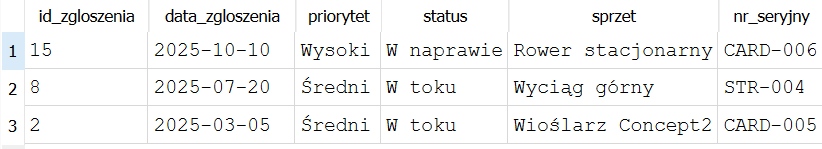

### Jasper reports

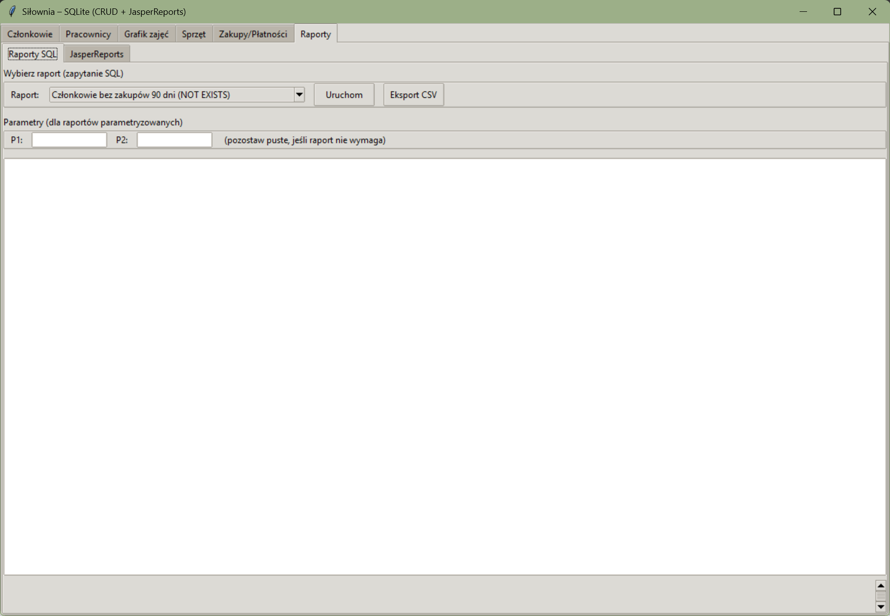
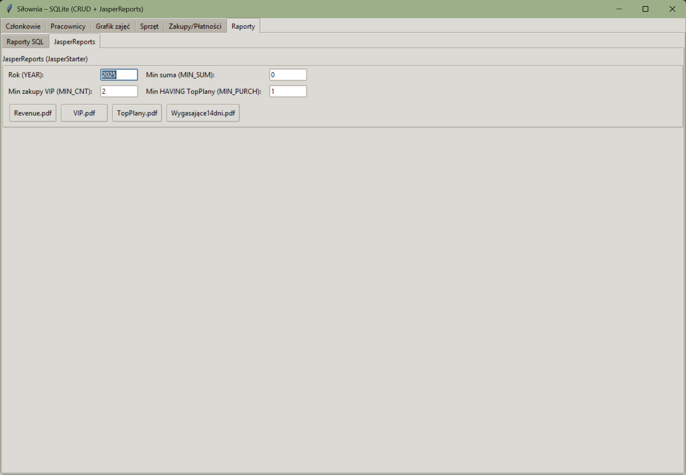


## Future Improvments

- [ ] Generating reports
- [ ] Update UI
- [ ] Upgrade app functionality
